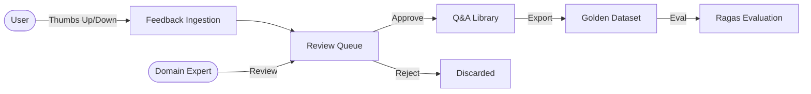

# Feedback System & Quality Assurance

Amber 2.0 includes a comprehensive **Feedback Loop** designed to continuously improve system accuracy through human-in-the-loop (HITL) validation.

## Architecture



## 1. User Feedback
Users can rate any AI response in the chat interface:
- **Thumbs Up**: "This answer is accurate and helpful."
- **Thumbs Down**: "This answer is incorrect, hallucinated, or incomplete."

When a rating is submitted, the system captures:
- The full query and response.
- The retrieved context chunks (provenance).
- The model used and generation parameters.
- User comments (optional).

## 2. Review Queue (`/admin/feedback/review`)
The Admin Dashboard provides a dedicated interface for reviewing user feedback.

### Workflow
1. **Inbox**: All user ratings appear in the "Pending" tab.
2. **Analysis**: The Admin sees the user's query, the AI's answer, and the ground-truth sources.
3. **Action**:
   - **Verify**: Confirm the AI was correct. Moves to "Verified" status.
   - **Correct**: Edit the answer to provide the correct information. The corrected version is saved.
   - **Dismiss**: Ignore invalid feedback (e.g., user error).

## 3. Q&A Library
The **Q&A Library** acts as the long-term memory of "known good" interactions. It serves two critical purposes:

### A. Golden Dataset Generation
Verified Q&A pairs are the gold standard for evaluation. You can export this dataset to:
- Run automated benchmarks (Ragas) to measure system drift.
- Test new prompts or retrieval parameters against proven questions.

### B. Fine-Tuning (Roadmap)
In future versions, this library will be used to Direct Preference Optimization (DPO) training for local models, teaching them the specific tone and domain knowledge of your organization.

## 4. Golden Dataset Export
Admins can export the verified Q&A pairs in standard formats:

- **JSONL**: Compatible with OpenAI fine-tuning and Ragas.
- **CSV**: For manual analysis in Excel/Google Sheets.

```json
// Example Export Format
{
  "messages": [
    {"role": "user", "content": "How do I reset my password?"},
    {"role": "assistant", "content": "Go to Settings > Profile > Security and click 'Reset Password'."}
  ],
  "metadata": {
    "verified_by": "admin@example.com",
    "verified_at": "2026-01-20T10:00:00Z",
    "original_context": [...]
  }
}
```
