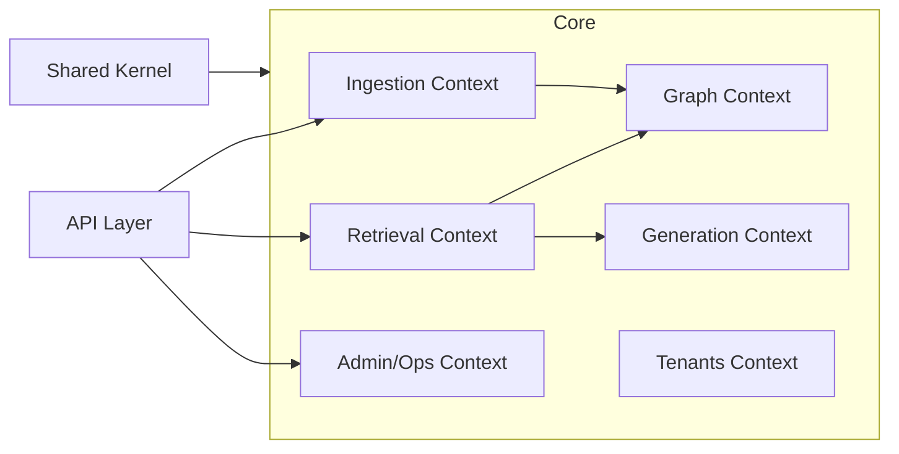

# Amber Service Boundaries

This document defines the bounded contexts in the Amber backend, their responsibilities, and interaction patterns. It serves as a reference for future microservices extraction.

## Bounded Contexts Overview

## Context Definitions

### 1. Ingestion Context
**Location**: `src/core/ingestion/`

**Responsibilities**:
- Document registration and deduplication
- File storage (MinIO)
- Text extraction (PDF, Markdown, etc.)
- Document classification  
- Semantic chunking
- Embedding orchestration

**Owns Data**:
- `documents` table
- `chunks` table
- `connector_states` table
- `folders` table

**External Dependencies**:
- MinIO (storage)
- Milvus (vectors via port)
- Neo4j (graph via port)

**Ports**:
- `DocumentRepository` - persistence abstraction
- `TaskDispatcher` - async job dispatch

---

### 2. Retrieval Context
**Location**: `src/core/retrieval/`

**Responsibilities**:
- Query parsing and routing
- Vector similarity search
- Graph traversal queries
- Hybrid retrieval fusion
- Re-ranking

**Owns Data**:
- Query cache (Redis)
- Retrieval metrics

**External Dependencies**:
- Milvus (vector search)
- Neo4j (graph queries)
- Redis (caching)

**Ports**:
- `VectorStorePort` - vector operations abstraction

---

### 3. Graph Context
**Location**: `src/core/graph/`

**Responsibilities**:
- Entity extraction from chunks
- Relationship mapping
- Community detection
- Graph maintenance
- Similarity edge creation

**Owns Data**:
- Neo4j graph (entities, relationships, communities)

**External Dependencies**:
- Neo4j

**Ports**:
- `GraphClientPort` - graph database access
- `GraphExtractorPort` - entity/relationship extraction

---

### 4. Generation Context
**Location**: `src/core/generation/`

**Responsibilities**:
- Prompt assembly
- LLM provider abstraction
- Streaming response handling
- Answer synthesis
- Memory management

**Owns Data**:
- `conversation_memory` table
- `generation_logs` (optional)

**External Dependencies**:
- OpenAI API
- Anthropic API
- Ollama (local)

**Ports**:
- `ProviderFactoryPort` - LLM/embedding/reranker provider factory

---

### 5. Admin/Ops Context
**Location**: `src/core/admin_ops/`

**Responsibilities**:
- API key management
- Usage tracking
- Feature flags
- Feedback collection
- Embedding migration
- Health monitoring
- Rate limiting

**Owns Data**:
- `api_keys` table
- `usage_records` table
- `feedback` table
- `flags` table
- `audit_logs` table
- `export_jobs` table

**External Dependencies**:
- Redis (rate limiting, metrics)

**Ports**:
- `TaskDispatcher` - migration job dispatch

---

### 6. Tenants Context
**Location**: `src/core/tenants/`

**Responsibilities**:
- Tenant configuration
- Multi-tenancy isolation
- Access policies
- RLS enforcement

**Owns Data**:
- `tenants` table

**External Dependencies**:
- PostgreSQL (RLS policies)

**Ports**:
- `TenantRepository` - tenant persistence

---

## Shared Kernel
**Location**: `src/shared/`

Cross-cutting concerns used by multiple contexts:
- `context.py` - Request context (tenant_id, request_id)
- `security.py` - API key hashing
- `identifiers.py` - ID generation
- `kernel/models/base.py` - Base SQLAlchemy model

**Rule**: Shared Kernel must NOT import from Core or API.

---

## Data Ownership Matrix

| Table                 | Owner Context |
| --------------------- | ------------- |
| `documents`           | Ingestion     |
| `chunks`              | Ingestion     |
| `folders`             | Ingestion     |
| `tenants`             | Tenants       |
| `api_keys`            | Admin/Ops     |
| `usage_records`       | Admin/Ops     |
| `feedback`            | Admin/Ops     |
| `flags`               | Admin/Ops     |
| `conversation_memory` | Generation    |

---

## Microservices Extraction Guide

If extracting to microservices:

1. **Ingestion Service**: Extract `src/core/ingestion/` + `src/workers/`
2. **Query Service**: Extract `src/core/retrieval/` + `src/core/generation/`
3. **Admin Service**: Extract `src/core/admin_ops/`

Each service would need:
- Own database schema (tables it owns)
- Event bus for cross-context communication
- API gateway for routing

---

## Import Contracts (Enforced by lint-imports)

| Contract                   | Status |
| -------------------------- | ------ |
| Domain Layer Independence  | ✅ KEPT |
| Application → Infrastructure Isolation | ✅ KEPT |
| Core → API Decoupling      | ✅ KEPT |
| Core → Platform Decoupling | ✅ KEPT |
| Shared Kernel Independence | ✅ KEPT |

Contracts are enforced by `poetry run lint-imports` and map to the dependency rules in this document.
