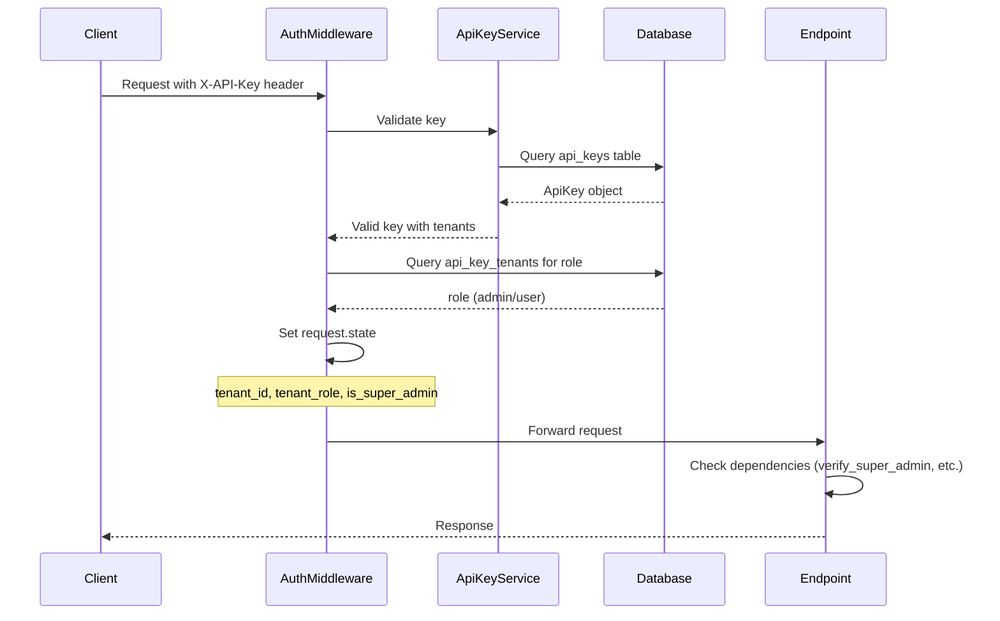

# Tenant Security & Role-Based Access Control

<!-- markdownlint-disable MD013 -->

## Overview

Amber implements a **dual-layer authentication and authorization system** that provides strict tenant isolation while supporting platform-wide administrative capabilities.

### Design Goals

1. **Strict Tenant Isolation**: Tenants cannot access each other's data under any circumstances.
2. **Principle of Least Privilege**: Users receive only the permissions necessary for their role.
3. **Privacy by Default**: Sensitive content (chat history) is redacted unless explicitly authorized.
4. **Hierarchical Administration**: Super Admins can manage the platform; Tenant Admins manage their own domains.

### Key Concepts

| Term            | Definition                                                                                 |
| --------------- | ------------------------------------------------------------------------------------------ |
| **Tenant**      | An isolated organizational unit with its own data, users, and configuration.               |
| **API Key**     | A credential that grants access to the API. Keys are linked to one or more tenants.        |
| **Scope**       | A global permission attached to an API Key (e.g., `super_admin`, `admin`).                 |
| **Tenant Role** | A context-specific role granted to a key within a specific tenant (e.g., `admin`, `user`). |

## Metadata

| Field        | Value       |
| ------------ | ----------- |
| Version      | 1.0.0       |
| Last Updated | 2026-01-22  |
| Status       | Implemented |

## Table of Contents

- [Overview](#overview)
- [Metadata](#metadata)
- [Architecture](#architecture)
- [Role Definitions](#role-definitions)
- [Capability Matrix](#capability-matrix)
- [Implementation Details](#implementation-details)
- [Privacy & Data Redaction](#privacy--data-redaction)
- [API Integration Guide](#api-integration-guide)
- [Testing](#testing)
- [Migration Guide](#migration-guide)
- [Troubleshooting](#troubleshooting)
- [References](#references)

## Architecture

### Authentication Flow



### Data Model

```text
+-----------------+       +---------------------+       +-------------+
| api_keys        |       | api_key_tenants     |       | tenants     |
+-----------------+       +---------------------+       +-------------+
| id (PK)       | ---->                                        | api_key_id (PK, FK) |       | id (PK)  |
| name          |                                              | tenant_id (PK, FK)  | <---- | name     |
| hashed_key    |                                              | role                |       | settings |
| scopes (JSON) |                                              | created_at          |       | ...      |
| is_active     | +---------------------+       +------------- |
| ...           |                                              |
+-----------------+                 |
                                    v
                         +----------------------+
| role values:       |
| - 'admin'          |
| - 'user' (default) |
                         +----------------------+
```

### Request State Injection

The `AuthenticationMiddleware` injects the following into `request.state`:

| Attribute        | Type        | Description                                                        |
| ---------------- | ----------- | ------------------------------------------------------------------ |
| `tenant_id`      | `TenantId`  | The resolved tenant context for this request.                      |
| `permissions`    | `list[str]` | Global scopes from the API Key (e.g., `['admin', 'super_admin']`). |
| `tenant_role`    | `str`       | Role within the current tenant (`admin`, `user`).                  |
| `is_super_admin` | `bool`      | `True` if `super_admin` is in scopes.                              |
| `api_key_name`   | `str`       | Name of the API key for logging.                                   |

## Role Definitions

### Global Scopes (Platform Level)

These are defined in the `api_keys.scopes` JSON array.

| Scope         | Description                                                                                                             |
| ------------- | ----------------------------------------------------------------------------------------------------------------------- |
| `super_admin` | Platform-wide administrative access. Can manage all tenants, global configuration, and perform cross-tenant operations. |
| `admin`       | Generic administrative capability. Typically redundant with Tenant Role but maintained for backward compatibility.      |
| `active_user` | Standard user with chat and RAG access.                                                                                 |

### Tenant Roles (Context Level)

These are defined in the `api_key_tenants.role` column for each key-tenant association.

| Role    | Description                                                                                           |
| ------- | ----------------------------------------------------------------------------------------------------- |
| `admin` | Full control over the specific tenant: manage users, update configuration, view metrics and feedback. |
| `user`  | Standard access: chat, document upload/read, view own history. Cannot access admin endpoints.         |

### Role Resolution Priority

1. **Super Admin** (`is_super_admin = True`): Bypasses all tenant-level restrictions.
2. **Tenant Admin** (`tenant_role = 'admin'`): Full access within their assigned tenant.
3. **Tenant User** (`tenant_role = 'user'`): Limited to user-facing endpoints.

## Capability Matrix

### Administrative Capabilities

| Capability                | Super Admin        | Tenant Admin        | Tenant User |
| ------------------------- | ------------------ | ------------------- | ----------- |
| **Tenant Management**     |                    |                     |             |
| Create Tenant             | Yes                | No                  | No          |
| Delete Tenant             | Yes                | No                  | No          |
| List All Tenants          | Yes                | Limited (Own Only)  | No          |
| **User & Key Management** |                    |                     |             |
| Create API Keys           | Yes (Any Tenant)   | Yes (Own Tenant)    | No          |
| Assign Roles              | Yes (Cross-Tenant) | Yes (Own Tenant)    | No          |
| Revoke Keys               | Yes                | Yes (Own Tenant)    | No          |
| **Configuration**         |                    |                     |             |
| Global Defaults           | Yes                | Limited (Read Only) | No          |
| Tenant Overrides          | Yes                | Yes                 | No          |
| Embedding Migration       | Yes                | No                  | No          |
| **System Operations**     |                    |                     |             |
| Cache Clear               | Yes                | No                  | No          |
| Orphan Pruning            | Yes                | No                  | No          |

### Data Access Capabilities

| Capability                  | Super Admin             | Tenant Admin            | Tenant User |
| --------------------------- | ----------------------- | ----------------------- | ----------- |
| **Documents**               |                         |                         |             |
| Upload                      | Yes (Any)               | Yes (Own)               | Yes (Own)   |
| Delete                      | Yes (Any)               | Yes (Own)               | No          |
| List                        | Yes (Any)               | Yes (Own)               | Yes (Own)   |
| **Chat History**            |                         |                         |             |
| Own History                 | Yes                     | Yes                     | Yes         |
| Other Users (No Feedback)   | Limited (Metadata Only) | Limited (Metadata Only) | No          |
| Other Users (With Feedback) | Yes (For QA)            | Yes (Own Tenant)        | No          |
| **Metrics & Feedback**      |                         |                         |             |
| Query Metrics               | Yes (All)               | Yes (Own Tenant)        | No          |
| User Feedback               | Yes (All)               | Yes (Own Tenant)        | No          |

### Cross-Tenant Access

| Scenario                   | Super Admin    | Tenant Admin | Tenant User |
| -------------------------- | -------------- | ------------ | ----------- |
| Access Other Tenant's Data | Yes (Explicit) | No           | No          |
| Query Across Tenants       | Yes            | No           | No          |
| Global Metrics View        | Yes            | No           | No          |

## Implementation Details

### Authentication Middleware

**File**: [src/api/middleware/auth.py](../src/api/middleware/auth.py)

The `AuthenticationMiddleware` is the central point for authentication and context injection.

```python
# Key logic in dispatch method:

# 1. Validate API Key
valid_key = await service.validate_key(api_key)

# 2. Resolve Tenant Context
tenant_id = resolve_tenant_from_header_or_key(...)

# 3. Fetch Tenant Role from Association
result = await session.execute(
    select(ApiKeyTenant.role).where(
        ApiKeyTenant.api_key_id == valid_key.id,
        ApiKeyTenant.tenant_id == str(tenant_id)
    )
)
tenant_role = result.scalar_one_or_none() or "user"

# 4. Inject into Request State
request.state.tenant_id = tenant_id
request.state.tenant_role = tenant_role
request.state.is_super_admin = "super_admin" in permissions
```

### Security Dependencies

**File**: [src/api/deps.py](../src/api/deps.py)

```python
async def verify_super_admin(request: Request):
    """
    Dependency: Requires Super Admin privileges.
    
    Usage:
        @router.post("/tenants", dependencies=[Depends(verify_super_admin)])
        async def create_tenant(...):
    """
    if not getattr(request.state, "is_super_admin", False):
        raise HTTPException(
            status_code=status.HTTP_403_FORBIDDEN,
            detail="Super Admin privileges required"
        )


async def verify_tenant_admin(request: Request):
    """
    Dependency: Requires Tenant Admin OR Super Admin privileges.
    
    Super Admins implicitly have Tenant Admin rights.
    """
    is_super_admin = getattr(request.state, "is_super_admin", False)
    tenant_role = getattr(request.state, "tenant_role", None)
    
    if is_super_admin:
        return  # Bypass for Super Admin
    
    if tenant_role != "admin":
        raise HTTPException(
            status_code=status.HTTP_403_FORBIDDEN,
            detail="Tenant Admin privileges required"
        )
```

### Applying Dependencies to Routes

```python
from fastapi import APIRouter, Depends
from src.api.deps import verify_super_admin, verify_tenant_admin

router = APIRouter()

# Super Admin only
@router.delete("/tenants/{tenant_id}", dependencies=[Depends(verify_super_admin)])
async def delete_tenant(tenant_id: str):
    ...

# Tenant Admin or Super Admin
@router.put("/config", dependencies=[Depends(verify_tenant_admin)])
async def update_config():
    ...
```

## Privacy & Data Redaction

### Rationale

Chat conversations may contain sensitive information. Even administrators should not have unrestricted access to user message content. The only exception is when the user has explicitly provided feedback (thumbs up/down), indicating they are comfortable with the interaction being reviewed for quality assurance.

### Implementation

**File**: [src/api/routes/admin/chat_history.py](../src/api/routes/admin/chat_history.py)

```python
# 1. Bulk lookup of conversations with feedback
feedback_query = select(Feedback.conversation_id).where(
    Feedback.conversation_id.in_(conv_ids)
).distinct()
conversations_with_feedback = {row[0] for row in (await session.execute(feedback_query)).fetchall()}

# 2. Per-conversation redaction logic
has_feedback = conv.id in conversations_with_feedback

if not has_feedback:
    query_text = "[REDACTED - PRIVACY]"
    response_text = "[REDACTED - PRIVACY]"
```

### Redaction Behavior

| Scenario                   | Query Text             | Response Text          | Metadata |
| -------------------------- | ---------------------- | ---------------------- | -------- |
| Own Chat                   | Visible                | Visible                | Visible  |
| Other User (No Feedback)   | `[REDACTED - PRIVACY]` | `[REDACTED - PRIVACY]` | `{}`     |
| Other User (With Feedback) | Visible                | Visible                | Visible  |

### Tenant Isolation

Tenant Admins can only view feedback-associated chats within their own tenant. This is enforced by:

1. **RLS Policies**: Database-level filtering via `app.current_tenant`.
2. **Middleware**: `request.state.tenant_id` is always set.
3. **Query Filters**: Explicit `WHERE tenant_id = :current_tenant` in queries.

## API Integration Guide

### Request Headers

| Header        | Required    | Description                                         |
| ------------- | ----------- | --------------------------------------------------- |
| `X-API-Key`   | Yes         | Your Amber API key.                                 |
| `X-Tenant-ID` | Conditional | Required if your key is linked to multiple tenants. |

### Error Responses

| Status | Code           | Description                                        |
| ------ | -------------- | -------------------------------------------------- |
| 401    | `UNAUTHORIZED` | Missing or invalid API key.                        |
| 403    | `FORBIDDEN`    | Insufficient permissions for this operation.       |
| 400    | `BAD_REQUEST`  | Multiple tenants available; specify `X-Tenant-ID`. |

### Example Requests

#### Super Admin: List All Tenants

```bash
curl -X GET https://api.amber.example/admin/tenants \
  -H "X-API-Key: grap_SUPER_ADMIN_KEY"
```

#### Tenant Admin: Update Config

```bash
curl -X PATCH https://api.amber.example/admin/config/default \
  -H "X-API-Key: grap_TENANT_ADMIN_KEY" \
  -H "X-Tenant-ID: my-tenant" \
  -H "Content-Type: application/json" \
  -d '{"rag_system_prompt": "You are a helpful assistant."}'
```

#### User: Chat (No Admin Access)

```bash
curl -X POST https://api.amber.example/v1/chat \
  -H "X-API-Key: grap_USER_KEY" \
  -H "Content-Type: application/json" \
  -d '{"query": "What is the capital of France?"}'
```

## Testing

### Unit Tests

| Test File                             | Coverage                                                              |
| ------------------------------------- | --------------------------------------------------------------------- |
| `tests/unit/test_security.py`         | API key generation, hashing, verification (12 tests).                 |
| `tests/unit/test_role_enforcement.py` | `verify_super_admin`, `verify_tenant_admin`, privacy logic (6 tests). |

### Running Tests

```bash
# All security tests
pytest tests/unit/test_security.py tests/unit/test_role_enforcement.py -v

# Expected output:
# 18 passed
```

### Test Cases for Role Enforcement

| Test                                      | Description                                    |
| ----------------------------------------- | ---------------------------------------------- |
| `test_verify_super_admin_success`         | Super Admin passes the check.                  |
| `test_verify_super_admin_failure`         | Non-Super Admin gets 403.                      |
| `test_verify_tenant_admin_as_super_admin` | Super Admin bypasses Tenant Admin check.       |
| `test_verify_tenant_admin_success`        | Tenant Admin passes for their tenant.          |
| `test_verify_tenant_admin_failure`        | Regular User gets 403.                         |
| `test_privacy_redaction_logic`            | Redaction applies correctly based on feedback. |

## Migration Guide

### For Existing Deployments

If you are upgrading from a pre-Role-Model version:

1. **Database Migration**: Ensure `api_key_tenants.role` column exists (default: `'user'`).
2. **Promote Admins**: Update existing admin keys to have `role = 'admin'` in the association table.
3. **Super Admin Scope**: Add `'super_admin'` to the `scopes` array for platform administrators.

```sql
-- Promote an existing key to Tenant Admin
UPDATE api_key_tenants 
SET role = 'admin' 
WHERE api_key_id = 'your-key-id' AND tenant_id = 'your-tenant-id';

-- Grant Super Admin scope
UPDATE api_keys 
SET scopes = scopes || '["super_admin"]'::jsonb 
WHERE id = 'your-platform-admin-key-id';
```

### Breaking Changes

> **Warning:**
>
> - Keys without explicit `role` in `api_key_tenants` default to `user`.
> - Chat history content is now redacted by default (unless feedback exists).
> - System-level endpoints (if locked down) will reject Tenant Admin keys.

## Troubleshooting

### Common Issues

| Symptom                            | Cause                                                 | Solution                                      |
| ---------------------------------- | ----------------------------------------------------- | --------------------------------------------- |
| 403 on all admin endpoints         | Missing `admin` role in `api_key_tenants`.            | Update the association with `role = 'admin'`. |
| 403 on tenant management           | Missing `super_admin` scope.                          | Add `super_admin` to `api_keys.scopes`.       |
| Chat history shows `[REDACTED]`    | No feedback on conversation.                          | This is expected behavior for privacy.        |
| "Multiple tenants available" error | Key linked to multiple tenants without `X-Tenant-ID`. | Provide the header.                           |

### Debugging

Enable debug logging to trace authentication decisions:

```python
# In settings or env
LOG_LEVEL=DEBUG
```

Log output will include:

```text
Authenticated: tenant=my-tenant, key=my-key-name, role=admin, super_admin=False, path=GET /admin/config
```

## References

- [Amber Tenant Role Model Proposal](../amber_tenant_role_model_proposal.md)
- [API Endpoints Documentation](./API_ENDPOINTS.md)
- Implementation Plan (local): `/home/daniele/.gemini/antigravity/brain/b2a04822-ce58-4470-abd6-bd03f3c80919/implementation_plan.md`
